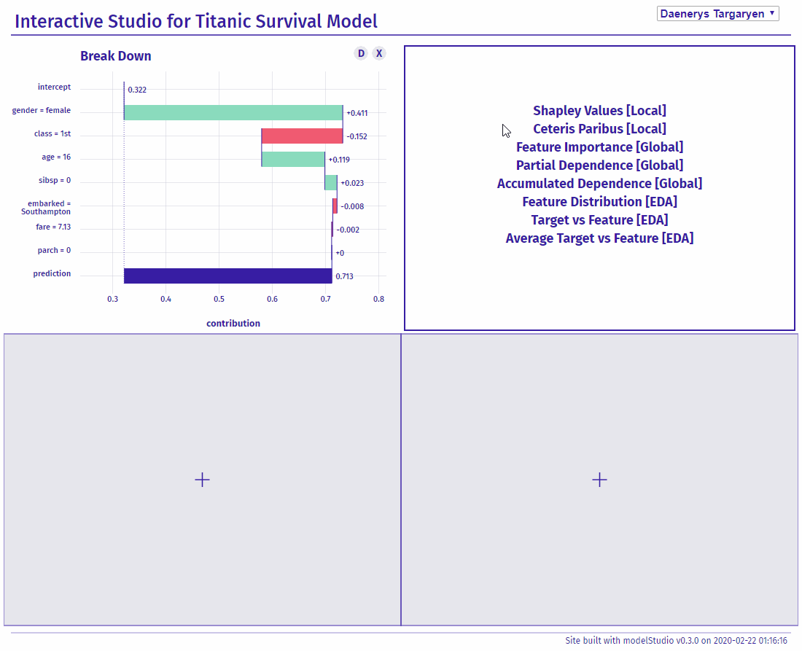

# Interactive Studio for Explanatory Model Analysis 

[](https://www.repostatus.org/#active)
[](https://cran.r-project.org/package=modelStudio)
[](https://travis-ci.org/ModelOriented/modelStudio)
[](https://codecov.io/github/ModelOriented/modelStudio?branch=master)
[](http://drwhy.ai/#AutoMat)
[](https://joss.theoj.org/papers/9eec8c9d1969fbd44b3ea438a74af911)

## Overview

The `modelStudio` package **automates the Explanatory Analysis of Machine Learning predictive models**. Generate advanced interactive and animated model explanations in the form of a **serverless HTML site** with only one line of code.

The main `modelStudio()` function computes various (instance and dataset level) model explanations and produces an **interactive, customisable dashboard made with D3.js**. It consists of multiple panels for plots with their short descriptions. Easily **save and share** the dashboard with others. Tools for model exploration unite with tools for EDA (Exploratory Data Analysis) to give a broad overview of the model behavior.

<!--- [explain FIFA19](https://pbiecek.github.io/explainFIFA19/) &emsp; --->
[**explain FIFA20**](https://pbiecek.github.io/explainFIFA20/) &emsp;
[explain Lung Cancer](https://github.com/hbaniecki/transparent_xai/) &emsp;
[**explain Python model**](https://modeloriented.github.io/modelStudio/articles/vignette_modelStudio.html#python-scikit-learn-model) &emsp;
[More Resources](https://modeloriented.github.io/modelStudio/#more) &emsp;
[**FAQ & Troubleshooting**](https://github.com/ModelOriented/modelStudio/issues/54)


The `modelStudio` package is a part of the [**DrWhy.AI**](http://drwhy.ai) universe.

## Installation

```r
# Install from CRAN: 
install.packages("modelStudio")

# Install the development version from GitHub:
devtools::install_github("ModelOriented/modelStudio")
```

## Demo

This package bases on `DALEX` explainers created with `DALEX::explain()`.

```r
library("DALEX")
library("modelStudio")

# Create a model
model <- glm(survived ~.,
             data = titanic_imputed,
             family = "binomial")

# Wrap it into an explainer        
explainer <- explain(model,
                     data = titanic_imputed[,-8],
                     y = titanic_imputed[,8],
                     label = "Titanic GLM")

# Pick some data points
new_observations <- titanic_imputed[1:4,]
rownames(new_observations) <- c("Lucas", "James", "Thomas", "Nancy")

# Make a studio for the model
modelStudio(explainer, new_observations)
```

Saved output in the form of a HTML file - [**Demo Dashboard**](https://modeloriented.github.io/modelStudio/demo.html).



## More Resources
  
  - [Explanatory Model Analysis. Explore, Explain and Examine Predictive Models.](https://pbiecek.github.io/ema)
  
  - [Conference Poster about modelStudio](misc/MLinPL2019_modelStudio_poster.pdf)

  - [Article about modelStudio](https://joss.theoj.org/papers/10.21105/joss.01798)
  
  - [News](NEWS.md)
  
  - [Read the vignette: modelStudio - perks and features](https://modeloriented.github.io/modelStudio/articles/vignette_modelStudio.html)  
    
  
## Save and Share

Save `modelStudio` as a HTML file using buttons on the top of the RStudio Viewer
or with [`r2d3::save_d3_html()`](https://rstudio.github.io/r2d3/articles/publishing.html#save-as-html).

<p align="center">
  
</p>

## Acknowledgments

Work on this package was financially supported by the `NCN Opus grant 2016/21/B/ST6/02176`.
