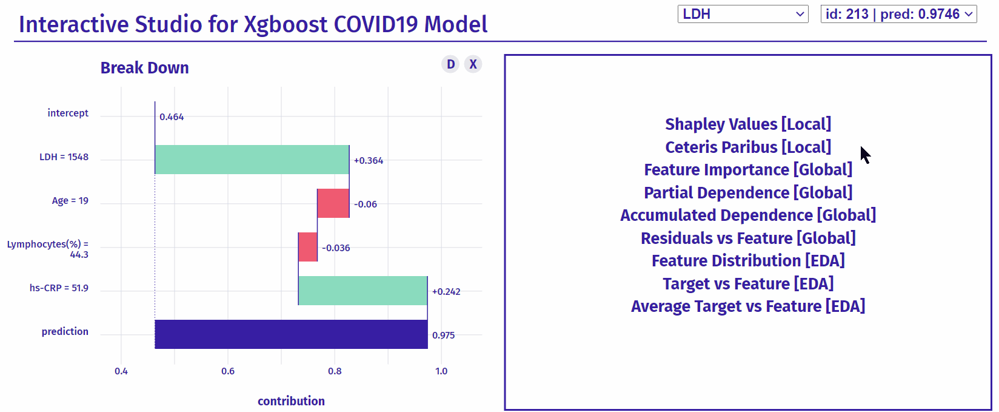

# Interactive Studio for Explanatory Model Analysis 

[](https://cran.r-project.org/package=modelStudio)
[](https://github.com/ModelOriented/modelStudio/actions?query=workflow%3AR-CMD-check)
[](https://codecov.io/github/ModelOriented/modelStudio?branch=master)
[](http://drwhy.ai/#AutoMat)
[](https://joss.theoj.org/papers/9eec8c9d1969fbd44b3ea438a74af911)

## Overview

The `modelStudio` package **automates the Explanatory Analysis of Machine Learning predictive models**. Generate advanced interactive and animated model explanations in the form of a **serverless HTML site** with only one line of code. This tool is model agnostic, therefore compatible with most of the black box predictive models and frameworks (e.g.&nbsp;`mlr/mlr3`, `xgboost`, `caret`, `h2o`, `scikit-learn`, `lightGBM`, `keras/tensorflow`).

The main `modelStudio()` function computes various (instance and dataset level) model explanations and produces an&nbsp;**interactive,&nbsp;customisable dashboard**. It consists of multiple panels for plots with their short descriptions. Easily&nbsp;**save&nbsp;and&nbsp;share** the dashboard with others. Tools for model exploration unite with tools for EDA (Exploratory Data Analysis) to give a broad overview of the model behavior.

<!--- [explain FIFA19](https://pbiecek.github.io/explainFIFA19/) &emsp; --->
<!--- [explain Lung Cancer](https://github.com/hbaniecki/transparent_xai/) &emsp; --->
&emsp; &emsp; &emsp; &emsp; &emsp; &emsp;
[**explain FIFA20**](https://pbiecek.github.io/explainFIFA20/) &emsp;
[**R & Python examples**](http://modelstudio.drwhy.ai/articles/ms-r-python-examples.html) &emsp;
[**More Resources**](http://modelstudio.drwhy.ai/#more-resources) &emsp;
[**FAQ & Troubleshooting**](https://github.com/ModelOriented/modelStudio/issues/54)



The `modelStudio` package is a part of the [**DrWhy.AI**](http://drwhy.ai) universe.

## Installation

```r
# Install from CRAN:
install.packages("modelStudio")

# Install the development version from GitHub:
devtools::install_github("ModelOriented/modelStudio")
```

## Simple Demo

```r
library("DALEX")
library("modelStudio")

# fit a model
model <- glm(survived ~., data = titanic_imputed, family = "binomial")

# create an explainer for the model    
explainer <- explain(model,
                     data = titanic_imputed,
                     y = titanic_imputed$survived,
                     label = "Titanic GLM")

# make a studio for the model
modelStudio(explainer)
```

[Save the output](http://modelstudio.drwhy.ai/#save--share) in the form of a HTML file - [**Demo Dashboard**](https://modeloriented.github.io/modelStudio/demo.html).


## R & Python Examples [more](http://modelstudio.drwhy.ai/articles/ms-r-python-examples.html)

The `modelStudio()` function uses `DALEX` explainers created with `DALEX::explain()` or `DALEXtra::explain_*()`.

```r
# packages for explainer objects
install.packages("DALEX")
install.packages("DALEXtra")

# update main dependencies
install.packages("ingredients")
install.packages("iBreakDown")
```

### mlr [dashboard](https://modeloriented.github.io/modelStudio/mlr.html)

In this example we will make a studio for the `ranger` model on `apartments` data.

```r
# load packages and data
library(mlr)
library(DALEXtra)
library(modelStudio)

data <- DALEX::apartments

# split the data
index <- sample(1:nrow(data), 0.7*nrow(data))
train <- data[index,]
test <- data[-index,]

# fit a model
task <- makeRegrTask(id = "apartments", data = train, target = "m2.price")
learner <- makeLearner("regr.ranger", predict.type = "response")
model <- train(learner, task)

# create an explainer for the model
explainer <- explain_mlr(model,
                         data = test,
                         y = test$m2.price,
                         label = "mlr")

# pick observations
new_observation <- test[1:2,]
rownames(new_observation) <- c("id1", "id2")

# make a studio for the model
modelStudio(explainer,
            new_observation)
```

### xgboost [dashboard](https://modeloriented.github.io/modelStudio/xgboost.html)

In this example we will make a studio for the `xgboost` model on `titanic` data.

```r
# load packages and data
library(xgboost)
library(DALEX)
library(modelStudio)

data <- DALEX::titanic_imputed

# split the data
index <- sample(1:nrow(data), 0.7*nrow(data))
train <- data[index,]
test <- data[-index,]

train_matrix <- model.matrix(survived ~.-1, train)
test_matrix <- model.matrix(survived ~.-1, test)

# fit a model
xgb_matrix <- xgb.DMatrix(train_matrix, label = train$survived)
params <- list(max_depth = 7, objective = "binary:logistic", eval_metric = "auc")
model <- xgb.train(params, xgb_matrix, nrounds = 500)

# create an explainer for the model
explainer <- explain(model,
                     data = test_matrix,
                     y = test$survived,
                     label = "xgboost")

# pick observations
new_observation <- test_matrix[1:2, , drop=FALSE]
rownames(new_observation) <- c("id1", "id2")

# make a studio for the model
modelStudio(explainer,
            new_observation,
            options = modelStudioOptions(margin_left = 140))
```

### scikit-learn [dashboard](https://modeloriented.github.io/modelStudio/scikitlearn.html)

The `modelStudio()` function uses `dalex` explainers created with `dalex.Explainer()`.

```console
pip install dalex
```

Use `pickle` Python module and `reticulate` R package to easily make a studio for a model.

```r
# package for pickle load
install.packages("reticulate")
```

In this example we will make a studio for the `Pipeline SVR` model on `fifa` data.

First, use `dalex` in Python:

```python
# load packages and data
import dalex as dx
from sklearn.model_selection import train_test_split
from sklearn.pipeline import Pipeline
from sklearn.preprocessing import StandardScaler
from sklearn.svm import SVR
from numpy import log

data = dx.datasets.load_fifa()
X = data.drop(columns=['overall', 'potential', 'value_eur', 'wage_eur', 'nationality'], axis=1)
y = log(data.value_eur)

# split the data
X_train, X_test, y_train, y_test = train_test_split(X, y)

# fit a pipeline model
model = Pipeline([('scale', StandardScaler()), ('svm', SVR())])
model.fit(X_train, y_train)

# create an explainer for the model
explainer = dx.Explainer(model, data=X_test, y=y_test, label='scikit-learn')

# pack the explainer into a pickle file
explainer.dump(open('explainer_scikitlearn.pickle', 'wb'))
```

Then, use `modelStudio` in R:

```r
# load the explainer from the pickle file
library(reticulate)
explainer <- py_load_object("explainer_scikitlearn.pickle", pickle = "pickle")

# make a studio for the model
library(modelStudio)
modelStudio(explainer, B = 5,
            options = modelStudioOptions(margin_left = 160))
```

## Save & Share

Save `modelStudio` as a HTML file using buttons on the top of the RStudio Viewer
or with [`r2d3::save_d3_html()`](https://rstudio.github.io/r2d3/articles/publishing.html#save-as-html).

<p align = "center", style="text-align: center;">
  
</p>

## More Resources

  - Citation: a preprint of [The Grammar of Interactive Explanatory Model Analysis](https://arxiv.org/abs/2005.00497)

  - Theoretical introduction to the plots: [Explanatory Model Analysis. Explore, Explain and Examine Predictive Models.](https://pbiecek.github.io/ema)

  - Vignettes: [modelStudio - perks and features](https://modeloriented.github.io/modelStudio/articles/ms-perks-features.html) and [modelStudio - R & Python examples](https://modeloriented.github.io/modelStudio/articles/ms-r-python-examples.html)  
  
  - Changelog: [NEWS](https://modeloriented.github.io/modelStudio/news/index.html)
  
  - Conference poster: [MLinPL2019](https://github.com/ModelOriented/modelStudio/blob/master/misc/MLinPL2019_modelStudio_poster.pdf)

  <!--  - [Article about modelStudio](https://joss.theoj.org/papers/10.21105/joss.01798) -->


## Acknowledgments

Work on this package was financially supported by the `NCN Opus grant 2016/21/B/ST6/02176`.
